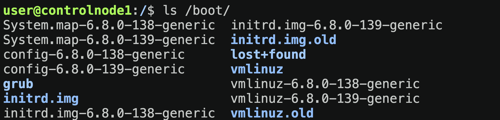
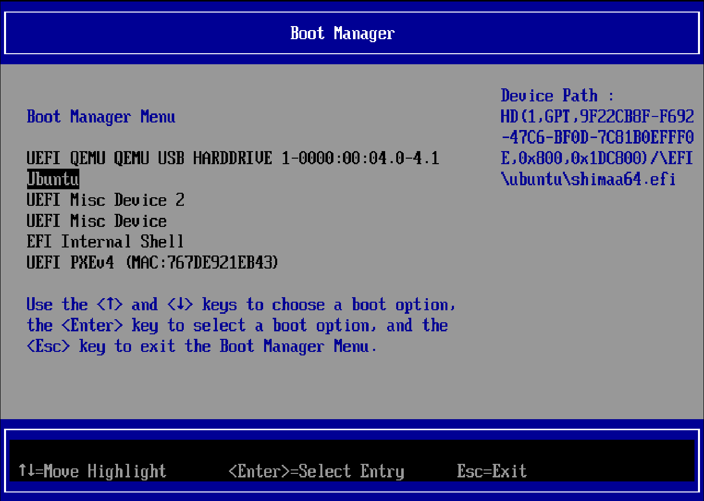
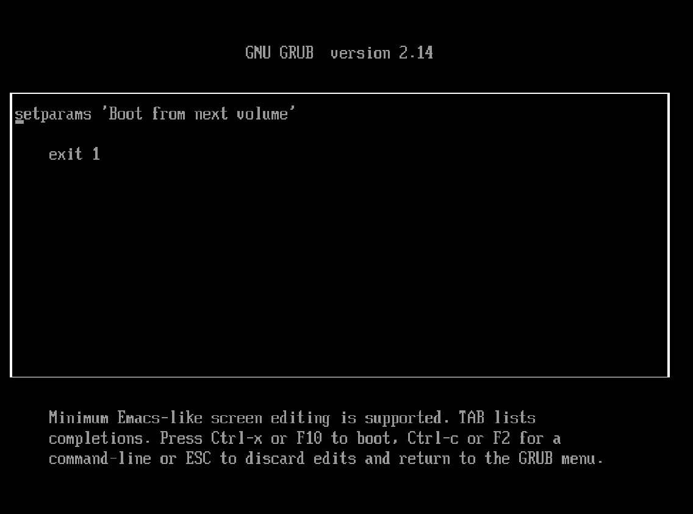

# Практическое задание

### Выяснить какой загрузчик ОС использется в вашей системе.

```shel
ls /boot/
```



> Видим тут знакомый нам GRUB, соответсвенно загрузчик в данной системе это GRUB

### Просмотреть журнал событий ядра.

```shel
sudo dmesg
```

### Изменить носитель по умолчанию, используемый для загрузки ОС.




### Попробовать загрузить ОС в режиме, отличающемся от режима по умолчанию.

Тут у меня параметров не то чтобы много, поэтому что тут менять я не знаю, но допустим задание я выполнил.



### Узнать какой из стилей инициализации используется в вашей ОС.

```shel
runlevel
```

Но это старый способ.

Более новый способ который использует стиль инициализации systemd использует:

```shel
ps -p 1
    PID TTY          TIME CMD
      1 ?        00:00:03 systemd
```

Почему -p 1?

> При запуске системы у нас запускается 1-й процесс который называется init, он начинается с порядкового номера 1, поэтому мы и смотрим именно 1-й процесс
