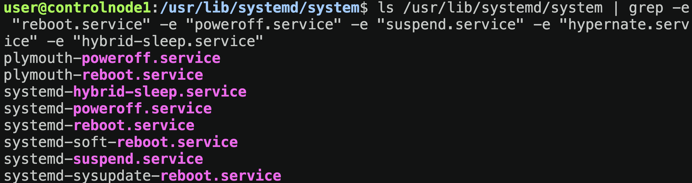

# Инициализация системы в стиле systemd

### Unit - модули, которыми оперирует systemd:

- `.service` - службы
- `.mount` - точки монтирования
- `.device` - устройства
- `.socket` - сокеты

`/usr/lib/systemd` - директория с юнитами по умолчанию

`/etc/systemd` - директория с управляемыми юнитами

Система может быть запущена в определенном уровне, таких уровней 7, давайте их рассмотрим


| Runlevel | Target              | Description                                           |
| -------- | ------------------- | ----------------------------------------------------- |
| 0        | `poweroff.target`   | Выключение                                  |
| 1        | `rescue.target`     | Однопользовательский режим   |
| 2,4      | `multi-user.target` | Настраиваемые режимы               |
| 3        | `multi-user.target` | Многопользовательский режим |
| 5        | `graphical.target`  | Графика                                        |
| 6        | `reboot/target`     | Перезагрузка                              |

`systemctl list-units --type=target` - узнать запущенные таргеты

`systemctl isolate name.target` - переключиться на другой таргет

`systemctl set-default -f name.target` - устновить нужный target по умолчанию

> Чтобы узнать в каком режиме у нас запущена система нужно ввести команду `runlevel`

### Journald, управление службами

`journald` - служба журналирования, тут можно смотреть информацию о всех собитиях при запуске, остановки и перезагрузки юнитов

Несколько команд для усправления системой с помощью systemd

`systemctl reboot`

`systemctl poweroff`

`systemctl suspend`

`systemctl hibernate`

`systemctl hybrid-sleep`

У каждой из это операции есть свой юнит в systemd

```shell
ls /usr/lib/systemd/system | grep -e
 "reboot.service" -e "poweroff.service" -e "suspend.service" -e "hypernate.serv
ice" -e "hybrid-sleep.service"
```



Соответственно мы можем с помощью `systemclt star|stop|reload|restart|status <unit_name>` использовать эти сервисы указав их полное имя.

### `journalctl`

Journald - очень мощная утилита, с помощью мы можем просматривать все события по нашим юнитам, как системным так и пользовательским.

`journalctl -f` - покажет события в реальном времени, как при просмотре какого-то лог-файла с помощью tail -f

`journalctl -n` - покажет последние `n` событий

Например, мы хотим посмотреть последние 3 события по юниту ssh.service

```shell
journalctl -n3 --unit=ssh.service
Sep 20 20:24:55 controlnode1 sshd[746]: pam_unix(sshd:session): session opened 
for user user(uid=1000) by user(uid=0)
Sep 20 21:00:07 controlnode1 sshd[1497]: Server listening on 0.0.0.0 port 22.
Sep 20 21:00:07 controlnode1 sshd[1497]: Server listening on :: port 22.
```

Ради интереса можно посмотреть записи событий в journald по юниту ssh в реальном времени и попробовать подключиться на сервер

```shell
journalctl -f --unit=ssh.service
```

Данная команда будет мониторить события в реальном времени.
