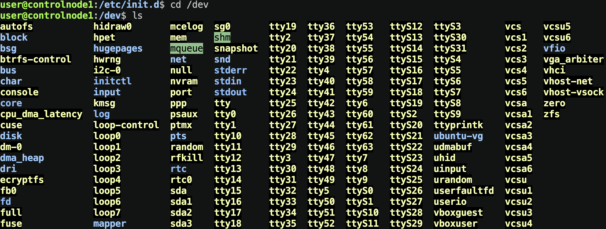
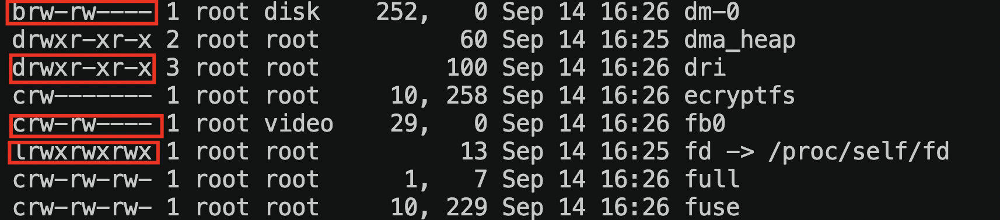
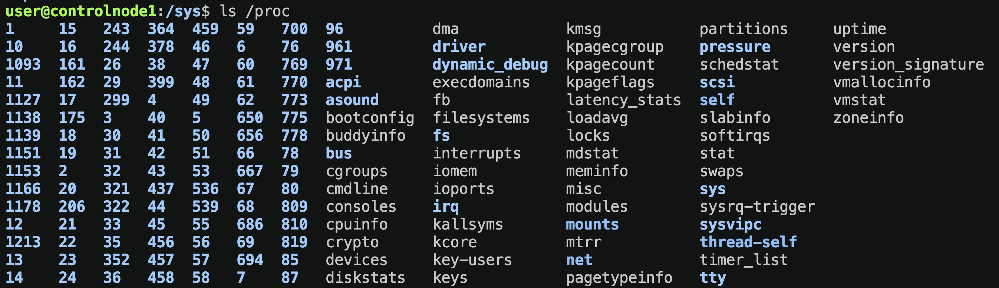
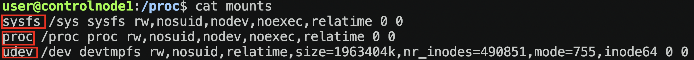

# Понимание `sysfs`, `devfs`, `udev`

## Немного теории

`HAL` - предоставляет абстракцию железа для OC, взаимодействие с драйверами железа происходит не напрямую, а через файлы этих драйверов ( то есть их абстракцию)

`Dbus` - предоставляет информацию о железе софту

`Udev` - современный менеджер устройств

Преимущества `Udev`:

- работает на уровне пользователя
- управляет событиями
- понятные файлы конфигов
- держит в системе только файлы активных устройств
- сохраняет имена устройств при переподключении

### HAL - hardware abstraction level - DEPRECATED

Предоставляет абстракцию железа для ОС. Это программная подсистема через которую операционная система обращается к абстрактному предтавлению железа, то есть ядро системы не напрямую обращается к железу, а к его абстрактному предтавлению ( в виде файлов, в Linux в целом всё предтавленно в виде файлов ).

> То есть если мы хотим обратиться к драйверу сетевой карты, это не происходит напрямую обращение к драйверу, а к файлу в директории который является предтавлением этого драйвера.

`HAL` уже не используется, его заменил `udev` о котором мы поговорим позже, но для полного понимания его нужно разобрать.

### `devfs` - devices file system

Виртуальная файловая система ( то есть не имеет физического носителя в виде жесткого диска, флеш-накопителя, ssd и так далее). Как правило она находится на оперативной памяти и монтируется в реальную файловую систему на диске `dev`.

Она в себе содержала следующее:

- `mem` - образ физической памяти ПК
- `null` - пустое устройство, обычно туда направляют ненужный вывод

  ```sh
  echo "some wrong string" > dev/null
  ```
- `pts/` - псевдотерминалы
- `urandom` - генератор случайных чисел
- `sdx` - блочные устройства
- `tty` - аппаратные терминалы

Перейдя в `dev/` мы можем увидеть все устройства инициализированные и представлены в виде абстракций ( то есть файлов) в нашей системе.


Тут есть тот самый `null` что является некой "черной дырой", драйвер нашего cpu, дисков и так далее.

> Данная файловая система была создана исходя из псевдофайловой системы `devfs` которая была монтирована ( встроена ) в каталог `/dev`

Для примера давайте рассмотрим какие типы сущностей тут есть.



В начале каждой строки мы видим первуб букву которая отвечает за определение типа сущности.

Стандартные мы рассматривать не будем, так как они нам не очень интересны, но рассмотрим те что попадаются редко в работе.

- `b` - block. Блочное устройство. Отправляет и принимает данные блоками
- `c` - character. Символьное устройство. Отправляет и принимает данные потоком данных.

Их там большое количество, это и есть те самые драйверы что представлены в виде абстракций, то есть когда мы обращаемся к файлу устройства -> мы обращаемся к его драйверу.

### Пример 1

```sh
user@controlnode1:/dev$ none
-bash: none: command not found
user@controlnode1:/dev$ none > /dev/null 2>&1
```

Что тут произошло?

> Мы ввели несуществующую команду `null` о чем нам в вежливой манере bash ответил что такой команды не существует. При повторном вводе мы увидим тоже самое. Но вот теперь мы решили направить весь `stdout` то есть весь вывод который мы получаем, а также `stderr` в /dev/null
>
> Подетальный разбор конструкции
>
> * **`2` (Standard Error)** **— дескриптор потока ошибок. Сюда программы отправляют сообщения о сбоях.**
> * **`>` (Перенаправление)** **— оператор, который перенаправляет поток из левой части в правую.**
> * **`&` (Указатель дескриптора)** **— технический символ. Он говорит: «внимание, дальше идет номер потока, а не текстовое имя файла».**
> * **`1` (Standard Output)** **— дескриптор основного потока вывода. Сюда отправляется обычный текст работы программы.**

### Пример 2

Теперь обратимся к другому устройству, которое генерирует случайную строку `/dev/urandom`

```sh
head -1 /dev/urandom > random_string.txt
cat random_string
z�>q�́���+�P�'<!I�)���#>"�P��A�PæJd���j�k�+�ov�
                                               d�]S�Ō]���a}_����2ʈԶ�Iؖ����
                                                                         �O��0�Vr~����u�ʊ���n/Ų�o�q��7�g=��,��5Ń�     �RZs&�ǃ�

```

Мы обратились к `/dev/urandom` взяв с помощью команды `head -1` первую строку и направили `stdout` в текстовй файл `random_string.txt` . В итоге получили строку случайно длины и случайным набором символов.

### `Sysfs` - system file system

`sysfs` тоже является виртуальной файловой системой, вот только отличие её от `devfs` в том что она содержит информацию о всех драйверах и устройствах в системе, в то время как `devfs`  представляет каждое устройство в виде абстракции.


`sysfs`  экспортирует информацию о драйверах и устройствах на уровень пользователя. Монтируется в файловую систему `/sys`.

Небольшой перечень того что она в себе содержит:

- `devices/` - все устройства, зарегистрированные в ядре
- `bus/` - перечень шин
- `drivers/` - драйверы
- `block/` - каталог блочных устройств
- `class/` - группировка устройств по классам

### `Procfs` processor file system

Тоже является виртуальной файловой системой. Данная файловая система относится к процессору, она содержит в себе иерархическое предствление всех процессов в системе. Монтируется в `/proc`. Опять же, перейдя в неё и введя `ls` мы увидим все запущенные процессы в системе ->



Небольшой перечень что данная файловая система в себе содержит

- `PID/` - информация о конкретном процессе в системе ( например директория с именем 10 содержит в себе всю информацию о процессе с идентификатором 10 )
- `cpuinfo/` - сведения о cpu
- `devices/` - перечень настроенных устройств
- `mounts/` - смонтированные файловые системы
- `sys/` - доступная для редактирования информация о системе

> При вводе команды `uptime` мы получаем информацию непосредственно из `/proc/uptime`.

То что мы рассмотрели выше ( какие виртуальные системы существуют ) и куда они монтируются можно посмотреть в `/proc/mounts`



И так, мы рассмотрели какие бывают виртуальные файловые системы, devfs, sysfs, procfs.

**Ещё раз закрепим, виртуальные они потому что не имеют физического носителя, они существуют на оперативной памяти, процессоре и после чего в виде абстракций монтируются ( переносятся в нужную файловую систему `/dev`, `/sys`, `/proc`).**
