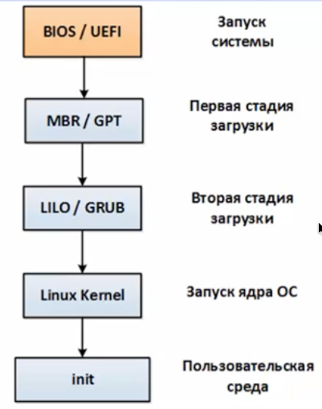

# Процесс загрузки Linux

Очень частый вопрос на собеседовании, но ответ на него нам нужен не только для того чтобы отвечать заученный монолог про то как система загружается, но и для полного понимания.

Вкратце процесс загрузки выглядит так:

* при старте ПК процессор переходит на адрес BIOS (UEFI) и загружает его;
* BIOS (или современный UEFI) проводит необходимые проверки, выбирает согласно своим настройкам носитель информации;
* на носителе находит MBR (или GPT для UEFI) в которой находится загрузчик;
* дальше по обстоятельствам: загрузчик может загружать ОС, может передать управление следующему загрузчику по цепочке;
* в любом случае загрузчик знает где лежит ядро ОС, грузит его и InitialRamDisk (там конфигурационные файлы и модули необходимые для загрузки ядра) в оперативную память;
* загруженное ядро берет дальнейший процесс запуска на себя (инициализация устройств, конфигурирование процессора, памяти и т.д.)
* после всех инициализационных процедур ядро запускает процедуры инициализации всех необходимых служб ОС.
