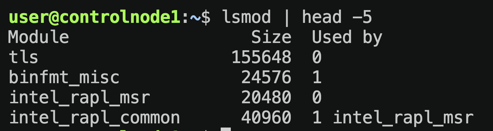

# Управление устройствами в Linux

Для начала разберемся какими командами мы можем пользоваться для вывода списка оборудания

- `lsmod` - информация о модулях ядра
  Выведем пару строк из того что нам дал stdout
  `lsmod | head -5` (`head -5` выводит первые 5 строк из `stdout`)

  
- `lspci` - информация об устройствах PCI
- `lpcmcia` - информация об устройствах PCMCIA
- `lsusb` - информация о шине USB
- `lshal` - база устройств HAL - DEPRECATED
- `lshw` - детальная информация о комплектующих - DEPRECATED

Предыдущие две команд уже не используются и они недступны так как HAL больше не используется, как нам уже известно его заменил `udev`

`udev` - позволяет нам взаимодействовать с устройствами в системе и получать о них информацию. У него есть команда для взаимодействия с устройствами `udevadm`.

### `udevadm`

Утилита позволяющая получать инфу об устройствах, запрашивать какие либо события, управлять, следить за событиями и так далее. Вот несколько опций этого инструмента.

- `info` - получение информации об устройстве из БД. Информация хранится в `/sys`
  Допустим хотим получить информацию об устройстве `/dev/null` ->

  ```sh
  user@controlnode1:/sys/dev$ udevadm info /dev/null
  P: /devices/virtual/mem/null
  M: null
  U: mem
  D: c 1:3
  N: null
  L: 0
  E: DEVPATH=/devices/virtual/mem/null
  E: DEVNAME=/dev/null
  E: DEVMODE=0666
  E: MAJOR=1
  E: MINOR=3
  E: SUBSYSTEM=mem
  ```

  Давайте убедимся что он действительно берет информацию об устройстве из `/sys`

  ```sh
  user@controlnode1:/sys/dev$ sudo find /sys -name null
  /sys/class/mem/null
  /sys/devices/virtual/mem/null
  ```

  - `trigger` - запросить события для устройства
  - `settle` - дождться завершения обработки
  - `control` - управление демоном
  - `monitor` - следить за событиями
  - `test` - симулировать запуск события

### Управление модулями ядра

При ввод `lsmod` в терминале мы видим все модули ядра, так вот, ими можно управлять. Команды для управлением модулями ядра ->

- `lsmod` - информация о модулях ядра
- `modinfo` - информация о конкретном модуле
- `rmmod` - удаление модуля ядра
- `insmod` - установка модуля ядра (почти не используется)
- `modprobe` - деликатное удаление или добавление модулей (зачастую какие-то модули требуют зависимости, при использовании данной команды зависимости тоже подягиваются в отличие от команд `insmod`).
